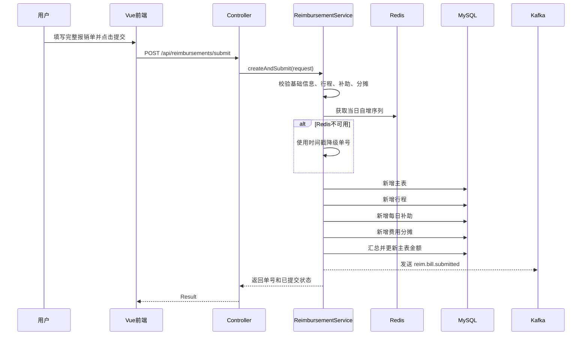
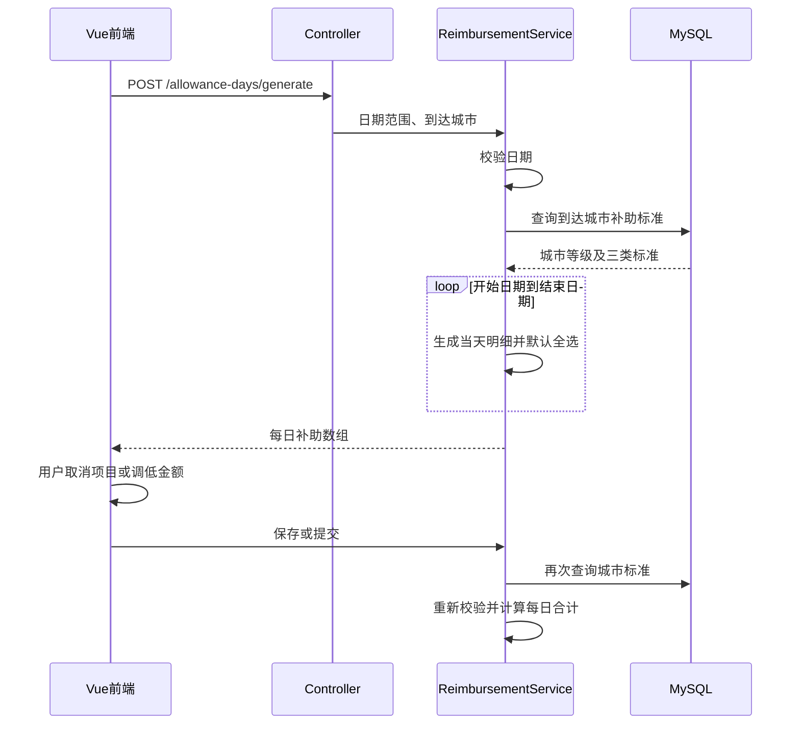
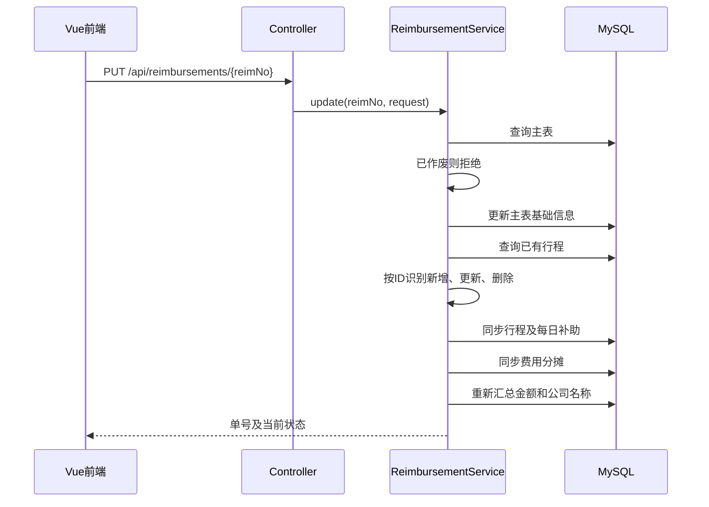
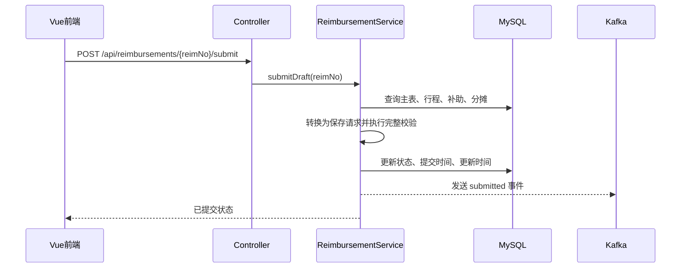
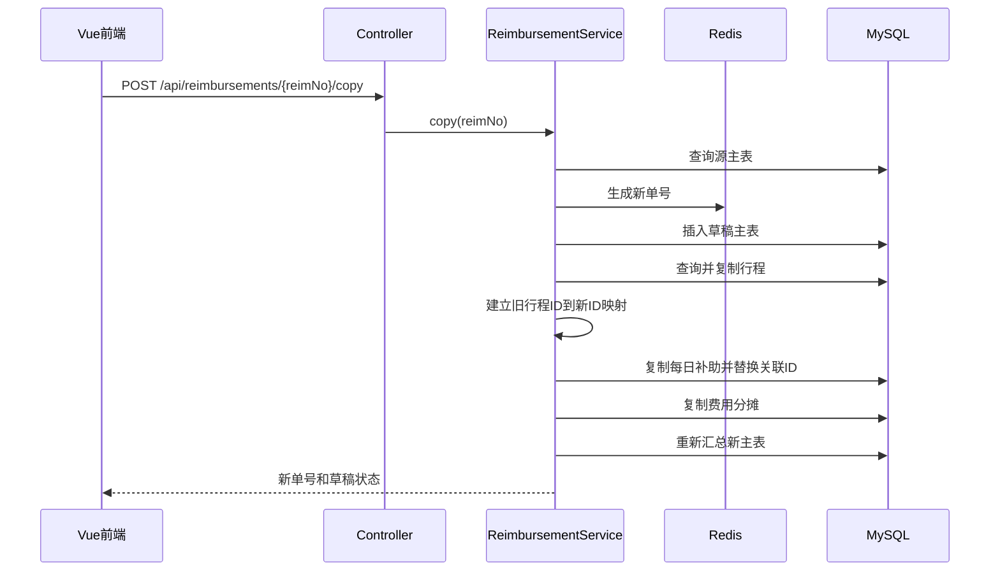
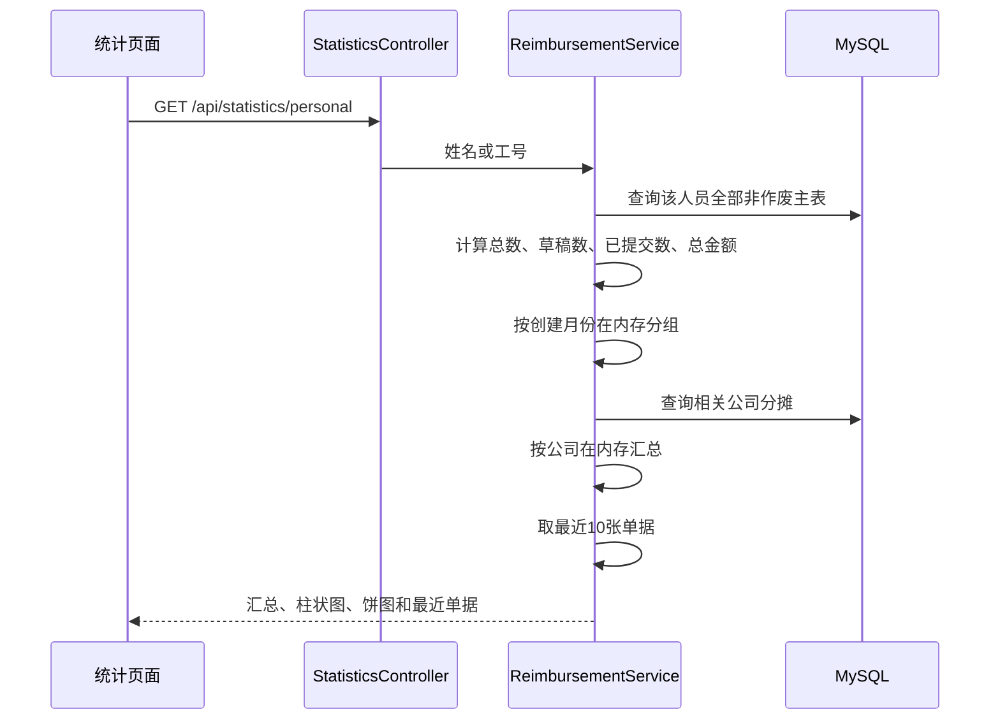

# 差旅报销单功能实现与优化说明

> 文档版本：2026-06-10  
> 本文区分“当前已经实现”和“后续建议”，不把规划功能描述成现有能力。

## 1. 系统结构

当前项目采用前后端分离结构：

- 前端：Vue 3、Vite、Element Plus、Axios、ECharts。
- 后端：Spring Boot 3.2.10、Java 17、MyBatis-Plus。
- 数据库：MySQL。
- Redis：已引入并用于报销单号生成，连接失败时会降级。
- Kafka：已引入，默认关闭；提交和作废时可发送事件。
- Redisson：POM 已引入依赖，但当前业务代码尚未使用。

### 1.1 请求链路

```text
Vue 页面
  -> frontend/src/api/reimbursement.js
  -> Axios 实例（baseURL=/api）
  -> Spring Controller
  -> ReimbursementService
  -> MyBatis-Plus Service/Mapper
  -> MySQL
```

Axios 响应拦截器读取统一响应对象：

- `code === 200`：直接把 `data` 返回给页面。
- `code !== 200`：使用 Element Plus 弹出错误信息，并拒绝 Promise。
- 网络错误或 HTTP 请求失败：显示网络异常信息。

## 2. 核心数据表职责

| 表 | 作用 | 主要关系 |
| --- | --- | --- |
| fk_reim_main | 报销单主表，保存基础信息、状态和金额汇总 | 一张报销单对应多条行程和分摊 |
| fk_reim_itinerary | 行程表，保存出行人、城市、日期和说明 | `main_id -> fk_reim_main.id` |
| fk_reim_allowance_day | 每日补助明细，保存每天三类补助标准与实报金额 | 同时关联 `main_id` 和 `itinerary_id` |
| fk_reim_allocation | 费用归属及分摊，保存公司、比例和金额 | `main_id -> fk_reim_main.id` |
| fk_city_allowance | 城市补助标准，保存城市等级和三类每日标准 | 生成、保存补助时查询 |

主表中的以下字段属于汇总或查询优化字段：

- `allowance_amount`
- `meal_amount`
- `traffic_amount`
- `communication_amount`
- `reim_company_names`

权威的每日金额来自 `fk_reim_allowance_day`，权威的费用归属来自 `fk_reim_allocation`。

## 3. 新建草稿处理流程

前端点击“保存草稿”后，调用：

```http
POST /api/reimbursements/draft
```

### 3.1 当前内部处理

1. Controller 将 JSON 反序列化为 `ReimbursementSaveRequest`。
2. `createDraft` 开启 Spring 数据库事务。
3. `nextReimNo()` 生成单号：
   - Redis 可用时，对 `reim:no:yyyyMMdd` 执行自增。
   - 生成格式为 `CLBX + yyyyMMdd + 四位序号`。
   - Redis 不可用或调用异常时，降级为 `CLBX + yyyyMMdd + HHmmssSSS`。
4. 创建 `fk_reim_main`：
   - 状态写为 `DRAFT/草稿`。
   - 单据类型写为 `TRAVEL_REIMBURSEMENT/差旅费用报销单`。
   - 写入前端已填写的基础字段。
5. 保存行程：
   - 缺少出发城市、到达城市或日期的行程被跳过。
   - 新行程没有 ID，执行新增。
   - 行程天数由后端按首尾日期计算。
6. 保存每日补助：
   - 如果行程没有传 `allowanceDays`，根据到达城市和日期范围自动生成。
   - 如果前端传了每日补助，则逐项校验并保存。
7. 保存分摊：
   - 没有归属名称的空分摊行被跳过。
   - 归属类型为空时默认 `COMPANY`。
8. 重新查询全部每日补助并汇总主表金额。
9. 根据分摊表中的公司记录汇总 `reim_company_names`。
10. 任一步骤抛出异常，事务回滚。

草稿允许不完整，因此可以只有主表，没有行程或分摊。

### 3.2 当前问题

- Redis 自增键没有设置过期时间，会永久保留每日序列键。
- 时间戳降级方案在多实例、高并发下不能绝对保证唯一。
- 不完整行程和空分摊被静默跳过，前端无法知道哪些数据没有保存。
- 行程、每日补助、分摊逐条插入，数据量大时 SQL 次数较多。

### 3.3 后续优化

- Redis 自增后为序列键设置合理过期时间。
- 使用 Redis Lua 一次完成自增和首次过期设置。
- 或使用 Redisson 分布式锁保护数据库号段生成器。
- 数据库对 `reim_no` 建唯一索引，作为最终一致性保护。
- 草稿保存响应中返回被忽略字段的提示，或明确禁止提交无效子项。
- 使用 MyBatis-Plus 批量插入减少数据库往返。

## 4. 新建并提交处理流程



### 4.1 提交校验

当前代码依次校验：

1. 标题、报销人、报销部门、业务类型和出差事由。
2. 至少一条行程。
3. 行程城市和日期完整，结束日期不早于开始日期。
4. 每日补助存在城市标准。
5. 每项实报金额大于等于 0，且不超过标准。
6. 未选中的补助项目金额强制为 0。
7. 至少一条费用分摊，且归属名称不为空。
8. 分摊比例合计为 100%。
9. 分摊金额合计等于补助总额，误差不超过 0.01。

`dayAmount`、主表总额和城市标准均由后端重新计算，不信任前端。

### 4.2 Kafka 当前行为

- 配置 `app.kafka.enabled=false` 时不发送消息，本地默认关闭。
- 开启后，提交成功时调用 `KafkaTemplate.send("reim.bill.submitted", reimNo)`。
- 当前项目没有 Kafka 消费者。
- 当前没有等待发送结果，也没有失败补偿表。
- 消息发送调用发生在数据库事务方法内部，但它不是数据库事务的一部分。

### 4.3 后续优化

- 增加提交幂等 Token，防止重复点击生成两张单据。
- Token 可存 Redis，并用 Lua 保证“校验和删除”原子化。
- Kafka 改为 Outbox 模式：
  - 报销单和待发送事件在同一个数据库事务中落库。
  - 独立任务可靠投递 Kafka。
  - 投递成功后更新事件状态。
- 或使用 Kafka 事务消息并设计明确的失败补偿。
- 对提交事件增加事件 ID、发生时间、单据状态和版本号，而不是只发送单号。

## 5. 每日补助生成与金额校验



### 5.1 计算规则

- 使用到达城市作为补助城市。
- 日期范围包含开始日和结束日。
- 客户端传入的每日补助日期必须位于对应行程日期范围内。
- 同一行程内的每日补助日期不得重复。
- 客户端传入的补助城市必须与行程目的地一致；校验后使用数据库中的权威城市信息覆盖请求值。
- 自动生成时三类补助默认全部选中。
- 用户可取消某天某项补助，取消后金额为 0。
- 用户可降低金额，但不能超过城市标准。
- 后端保存时重新查询 `fk_city_allowance`，前端传入的标准值不会被信任。
- 每日合计为餐补、交通补助、通讯补助之和。

### 5.2 历史标准处理

每日补助表同时保存了当时的城市等级和补助标准，具备历史快照字段。但当前更新旧报销单时，后端仍会重新查询最新城市标准并覆盖快照。

这意味着城市标准调整后，再编辑历史草稿，补助标准可能变化。

### 5.3 后续优化

- Redis 缓存城市标准，例如 `city:allowance:{cityCode}`。
- 使用 Cache Aside：
  - 查询时先读缓存，未命中再查数据库并回填。
  - 修改标准后删除对应缓存。
- 设置合理 TTL，并监控缓存命中率。
- 提交后的单据永久使用已保存的标准快照，不再按最新标准重算。
- 城市标准增加生效日期、失效日期和版本号，根据补助日期匹配正确版本。
- 对同一次保存涉及的相同城市，在请求内做 Map 缓存，避免每天重复 SQL 查询。

当前暂不校验同一人员的多条行程是否发生日期重叠。该问题可能涉及中转、跨城、审批状态等业务规则，本阶段交由后续审核流程处理。

## 6. 更新报销单与子表差异同步



### 6.1 差异同步规则

行程、每日补助和分摊均采用类似规则：

- ID 存在且属于当前父记录：更新原记录。
- ID 为空：新增记录。
- ID 不属于当前父记录：按新增处理。
- 数据库已有但请求没有带回：删除原记录。

行程删除时，代码先删除对应的每日补助，再删除行程。

### 6.2 当前风险

- 更新接口只禁止 `VOIDED`，没有限制只能修改 `DRAFT`。
- 已提交单据可以更新，而且不会重新执行完整提交校验。
- 前端漏传某个子项会被解释为删除，存在误删风险。
- 没有版本字段，并发编辑时后保存的人会覆盖先保存的人。
- 子表 ID 不属于当前单据时按新增处理，没有明确报错，容易掩盖前端数据错误。

### 6.3 后续优化

- 明确状态机：只有 `DRAFT` 可更新。
- 主表增加 `version` 字段并使用 MyBatis-Plus 乐观锁。
- 更新请求增加版本号；版本冲突返回“数据已被其他用户修改”。
- 子表 ID 不属于当前单据时直接拒绝，而不是新增。
- 对差异删除增加显式 `deletedIds`，避免“未传即删除”的误操作。
- 重要更新记录操作日志，保存修改人、时间和字段差异。

## 7. 提交已有草稿



### 7.1 当前问题

代码没有检查原状态必须是 `DRAFT`：

- 已提交单据可以重复提交。
- 已作废单据理论上也可重新写成已提交。
- 重复调用可能重复发送 Kafka 事件。

### 7.2 后续优化

- 使用带状态条件的原子更新：

```sql
UPDATE fk_reim_main
SET bill_status = 'SUBMITTED'
WHERE reim_no = ? AND bill_status = 'DRAFT';
```

- 受影响行数不是 1 时返回状态冲突。
- 配合 Redis 幂等 Token 或数据库唯一事件键，避免重复提交。
- 使用 Redisson 锁时，锁粒度使用 `reim:submit:{reimNo}`，并设置合理租约和等待时间。
- 分布式锁不能代替数据库状态条件，两者应配合使用。

## 8. 详情查询

当前详情接口执行：

1. 按单号查询主表。
2. 按 `main_id` 查询全部行程。
3. 按 `main_id` 查询全部每日补助。
4. 在内存中按 `itinerary_id` 对每日补助分组。
5. 按 `main_id` 查询全部费用分摊。
6. 组装嵌套 VO 返回前端。

该实现没有产生每条行程一次查询的 N+1 问题，固定约为 4 次查询，适合当前数据规模。

后续可以：

- 对只读详情增加短期缓存，但更新、提交、作废时必须失效。
- 对超大单据分页或懒加载每日明细。
- 使用 MapStruct 代替大量 `BeanUtils.copyProperties`，获得编译期字段检查。

## 9. 复制报销单



复制过程处于同一数据库事务中。任何一张表写入失败，整个新单据回滚。

### 9.1 当前问题与优化

- 子表逐条插入，较大单据复制效率较低。
- 复制沿用原补助标准和金额，这是合理的“完整复制”，但后续编辑时又可能按最新标准校验。
- 单号最终只依赖应用生成，仍需数据库唯一索引兜底。

建议：

- 使用批量插入行程、补助和分摊。
- 明确复制策略：复制金额后要求用户重新确认，或按当前标准重新生成。
- 增加复制来源字段，如 `source_reim_no`，便于审计。

## 10. 删除和作废

### 10.1 删除草稿

- 先查询主表并校验状态为 `DRAFT`。
- 依次删除每日补助、行程、分摊。
- 最后删除主表。
- 全过程在同一事务内。

当前使用应用层级联删除。数据库也可以增加外键和 `ON DELETE CASCADE`，但训练营项目中保留应用层控制更直观。

### 10.2 作废

- 草稿不允许作废，应直接删除。
- 非草稿单据状态更新为 `VOIDED/已作废`。
- Kafka 开启时发送 `reim.bill.voided`。

当前没有禁止重复作废。建议使用状态条件更新，只允许 `SUBMITTED -> VOIDED`。

## 11. 分页查询

主表使用 MyBatis-Plus `LambdaQueryWrapper` 动态拼接条件：

- 单号、标题、事由、费用归属公司使用 `LIKE`。
- 部门、姓名、工号、业务类型和状态使用 `=`。
- `reimburserKeyword` 使用“姓名等于关键字 OR 工号等于关键字”。
- 按创建时间倒序。

### 11.1 当前设计说明

费用归属公司直接查询主表冗余字段 `reim_company_names`，避免列表中为每张单据额外查询分摊表。

### 11.2 后续优化

- 限制 `pageSize` 最大值，例如 100。
- 为常用条件建立索引：
  - `UNIQUE(reim_no)`
  - `INDEX(bill_status, created_at)`
  - `INDEX(reimburser_no, created_at)`
  - `INDEX(reim_department_name)`
  - `INDEX(business_type_name)`
- `%关键字%` 模糊查询无法充分利用普通 B-Tree 索引；数据量大后可考虑前缀查询或 Elasticsearch。
- 多公司逗号拼接字段只适合展示和简单查询；严格公司筛选应查询分摊表或建立独立搜索表。

## 12. 费用归属及分摊

### 12.1 当前处理

- 前端显示百分数，提交前转换为 `0-1`。
- 后端也兼容传 `30` 表示 30%，但不推荐混用。
- 提交时比例合计必须等于 `1`。
- 金额合计必须等于每日补助总额。
- 某行金额为 0 且总金额大于 0 时，后端会按比例自动计算该行金额。
- 保存后，所有 `COMPANY` 分摊名称去重并写入主表 `reim_company_names`。

### 12.2 当前问题

- 后端仍接受 `DEPARTMENT`，与当前“费用归属只能是公司”的前端规则不完全一致。
- 比例既兼容 `0-1` 又兼容 `0-100`，接口语义不够严格。
- 每行四舍五入后可能产生尾差，目前只校验最终误差。

### 12.3 后续优化

- 后端强制 `allocationOwnerType=COMPANY`。
- DTO 明确只接受 `0-1`，超出范围直接报错。
- 后端统一计算分摊金额，前端金额仅作预览。
- 尾差固定放到第一行，并在后端实现同一套规则。
- 公司与项目改为关联字典表 ID，并验证 ID 和名称一致性。

## 13. 个人统计



### 13.1 当前计算口径

- 排除 `VOIDED` 单据。
- `totalAmount` 包含草稿和已提交单据。
- 月度统计按主表 `createdAt` 所在月份，不是提交月份。
- 公司占比按分摊表中的 `allocationAmount` 汇总。
- 最近单据按创建时间倒序取 10 条。

### 13.2 当前性能问题

当前先加载该人员所有主表记录，再在 Java 内存中统计。数据量增大后会消耗较多内存和网络带宽。

建议改为数据库聚合：

- `COUNT` 和 `SUM(CASE WHEN ...)`
- `GROUP BY DATE_FORMAT(created_at, '%Y-%m')`
- 分摊表按公司 `GROUP BY allocation_owner_name`
- 最近单据单独执行 `LIMIT 10`

同时应明确统计口径是否只包含已提交单据。财务统计通常不应把草稿计入累计报销金额。

## 14. 事务与一致性

以下操作使用 `@Transactional(rollbackFor = Exception.class)`：

- 创建草稿
- 创建并提交
- 更新
- 提交草稿
- 复制
- 删除草稿
- 作废

数据库异常和业务异常都会触发回滚。

但需要注意：

- Redis 自增不会随数据库事务回滚，出现跳号是正常的。
- Kafka 发送不会自动随 MySQL 事务回滚。
- 缓存写入如果以后加入，也需要设计事务后的失效时机。

推荐在数据库提交成功后再触发非事务性副作用，可靠事件应使用 Outbox。

## 15. 异常处理

当前全局异常处理：

- `IllegalArgumentException` -> `code=400`
- 其他 `Exception` -> `code=500`

### 15.1 当前问题

- HTTP 状态通常仍是 200。
- 所有业务错误都使用 `IllegalArgumentException`，无法区分资源不存在、状态冲突和权限错误。
- 框架参数绑定错误可能被归为系统异常。
- 日志缺少请求 ID、用户和报销单号上下文。

### 15.2 后续优化

- 定义 `BusinessException(code, message, httpStatus)`。
- 分别返回：
  - 400 请求参数错误
  - 404 单据不存在
  - 409 单据状态冲突或版本冲突
  - 403 无数据权限
  - 500 系统异常
- 使用 Bean Validation：
  - `@NotBlank`
  - `@NotNull`
  - `@DecimalMin`
  - `@DecimalMax`
  - 嵌套对象使用 `@Valid`
- 增加全链路 `traceId` 并写入响应和日志。

## 16. 安全、权限和审计

当前项目没有登录和权限控制，前端提交的报销人信息会被直接信任。

正式环境应增加：

- Spring Security 或统一认证网关。
- 报销人从登录身份获取，不允许任意伪造。
- 普通用户只能查看和修改自己的草稿。
- 管理员或财务角色才能作废、手工推送。
- 主表增加创建人、更新人、作废人。
- 建立操作日志表，记录创建、修改、提交、复制、删除、作废。
- 日志避免输出密码、Token 等敏感信息。

## 17. 建议的优化优先级

### P0：保证业务正确性

1. 限制只有草稿可修改、提交。
2. 限制作废只能执行一次。
3. 数据库为报销单号增加唯一索引。
4. 增加提交幂等控制。
5. 强制分摊归属只能为公司。
6. 返回正确 HTTP 状态。

### P1：保证并发与可靠性

1. 增加乐观锁版本号。
2. Redis Lua 或 Redisson 优化单号生成与提交锁。
3. Kafka 改为 Outbox 可靠事件。
4. 子表批量写入。
5. 城市标准增加版本和生效日期。

### P2：提升性能与可维护性

1. Redis 缓存城市补助标准。
2. 个人统计改为 SQL 聚合。
3. 增加查询索引并限制分页大小。
4. 使用 MapStruct 替代反射属性复制。
5. 引入 OpenAPI/Swagger 自动维护接口定义。
6. 增加 Micrometer 指标、慢 SQL 监控和统一链路日志。

## 18. 自动化测试建议

### 18.1 单元测试

- 北京 5 天游程生成 5 条补助。
- 餐补标准 100：实报 80 成功，110 失败。
- 取消补助后金额强制为 0。
- 草稿允许缺失字段。
- 提交缺少任一必填字段均失败。
- 分摊比例不是 100% 时失败。
- 分摊金额与总额不一致时失败。
- 主表金额由每日补助重新汇总。

### 18.2 集成测试

- 创建、详情、更新、提交完整闭环。
- 更新时对子表正确执行新增、修改和删除。
- 删除草稿级联删除所有子数据。
- 复制后新旧单据数据一致但主键、单号不同。
- 已提交单据不能修改，已作废单据不能再次作废。
- Redis 不可用时仍能创建单据。
- Kafka 关闭时应用正常启动。
- Kafka 开启时提交和作废各产生一次事件。

### 18.3 并发测试

- 多线程生成单号不重复。
- 同一草稿重复提交只成功一次。
- 两个用户同时更新时，后提交者收到版本冲突。
- 城市标准缓存失效后读取到最新标准。
